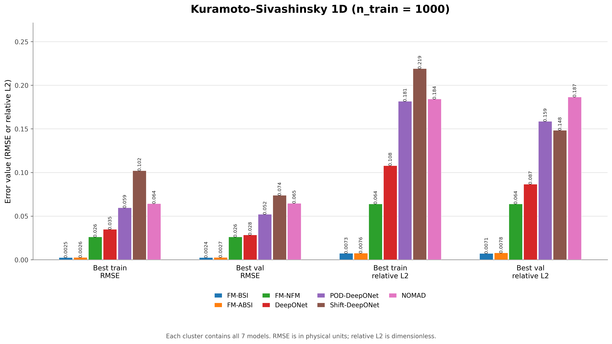
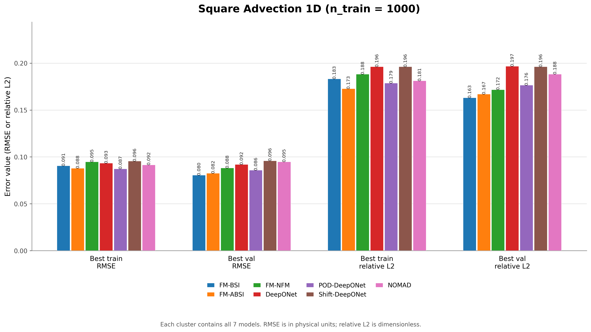
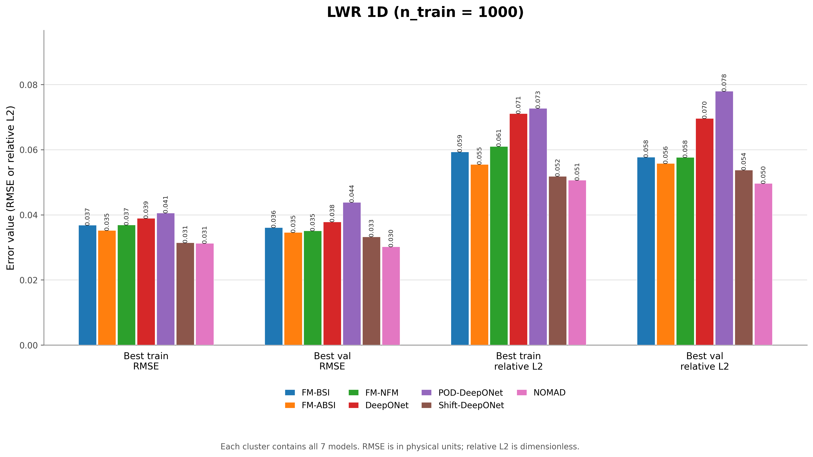
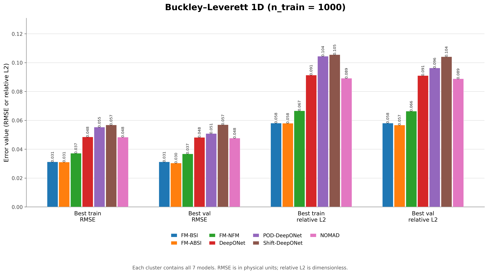
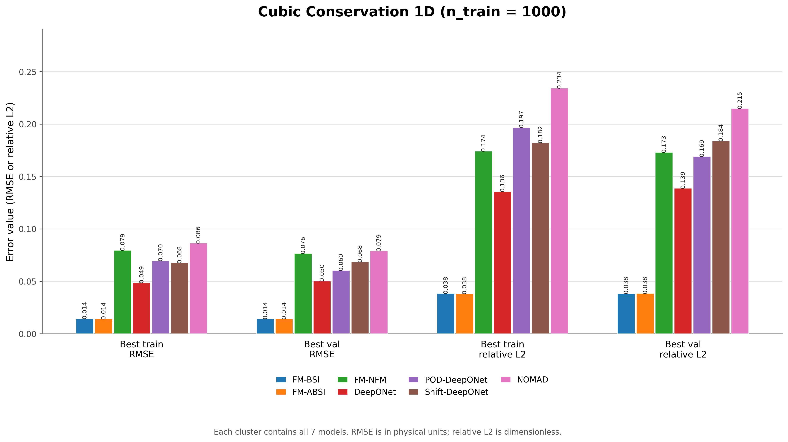
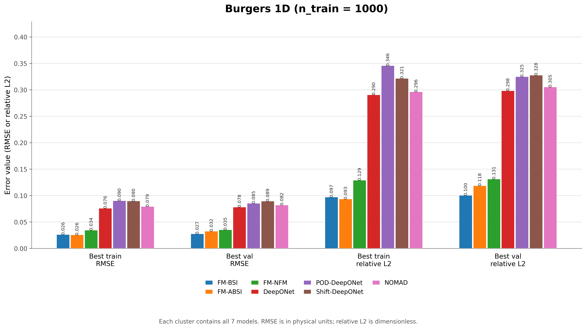
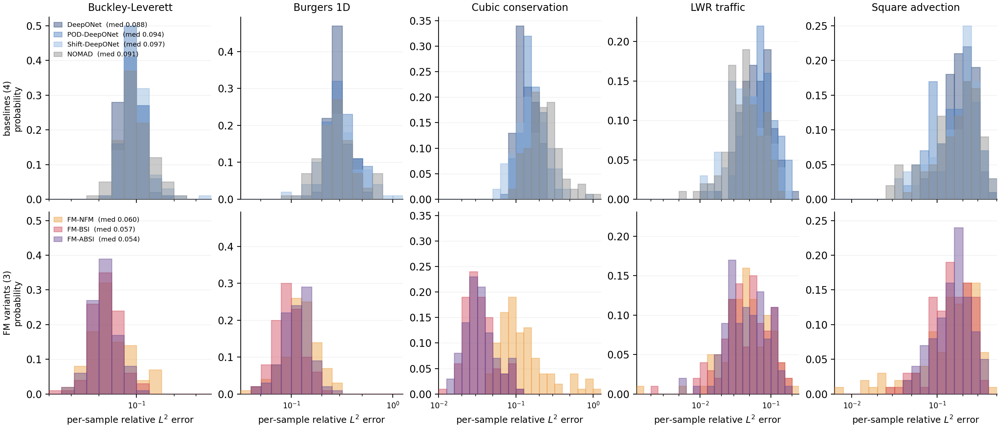

# FMO — Feature Interaction Modeling for Neural Operators

Reference implementation for
**[[2607.28762] Feature Interaction Modeling for Neural Operators](https://arxiv.org/abs/2607.28762)**.

> **Status: work in progress.** The paper is still being revised — the experiments
> are being completed and corrected, so the variants, the exact configurations and
> the reported numbers may still change. This repository tracks the code that is
> actually used to produce the results and is published early so that the models
> can be inspected and reused while the paper is finalised. Please treat every
> number as preliminary.

---

## Contents

```
v1/
├── FMO_BSI.py          low-rank bilinear interaction, uniform field-pair weights (baseline)
├── FMO_ABSI.py         FMO_BSI + attentive field-pair weights
├── FMO_MBSI.py         FMO_BSI with per-head MLP interaction factors
├── FMO_MABSI.py        MLP interaction factors + attentive field-pair weights
└── README.md
```

## Results

The complete source tables are stored in [`data`](data). The six equation-level
figures below show four clusters per equation: best train RMSE, best val RMSE,
best train relative L2, and best val relative L2. Every cluster contains all
seven models.

### Kuramoto–Sivashinsky 1D



### Square Advection 1D



### LWR 1D



### Buckley–Leverett 1D



### Cubic Conservation 1D



### Burgers 1D



### Per-sample relative $L^2$ error distribution



The error *distribution* behind the aggregated numbers above, for the five equations that
have the full seven-model sweep (Kuramoto–Sivashinsky 1D is not part of this figure).
Columns are the equations, rows group the models — the four baselines on top, the three
FM variants below. One relative $L^2$ error is computed per test trajectory and
histogrammed over the 100 trajectories of the test split; the numbers correspond to the
validation-selected checkpoint, i.e. the second value of each `train / val` pair in the
tables above.

Reading notes:

* Every bar covers a 0.1-decade error band and its height is the **fraction of test
  trajectories** whose error falls into that band, so the bar heights of one model sum
  to 1 and can be read directly as percentages. The height is not a count and not a
  probability density.
* Within a column the x range and the y scale are shared by the two panels, so a
  baseline and a variant can be compared error band by error band. Different equations
  keep their own x range.
* The median of each distribution is printed in the legend.

What the shapes add to the aggregated tables:

* **Burgers 1D** — the strongest separation: the FM variants sit almost entirely below
  the baselines, with medians of 0.094–0.124 against 0.268–0.296.
* **Cubic Conservation** — *FM-BSI* and *FM-ABSI* concentrate near 0.03 while the
  baselines have medians of 0.127–0.230 and a much wider spread. *FM-NFM* still improves
  the median (0.101 vs 0.127 for DeepONet) but keeps a heavier upper tail than the other
  two variants.
* **Buckley–Leverett** — all three variants shift left and narrow (medians 0.054–0.060
  against 0.088–0.097).
* **Square Advection** — the variants are better on the median but the distributions
  overlap heavily: the improvement is real, the separation is not clean.
* **LWR 1D** — the seven distributions are nearly indistinguishable (medians
  0.044–0.067). This equation does not discriminate between the models, which is worth
  keeping in mind when reading the aggregate tables.

## Requirements

* Python ≥ 3.9
* PyTorch ≥ 2.0 (CPU is enough; the scripts use CUDA automatically when available)

## Citation

```bibtex
@misc{gu2026featureinteractionmodelingneural,
  title         = {Feature Interaction Modeling for Neural Operators},
  author        = {Quan Gu and Xiaoduo Li and Hongxia Liu},
  year          = {2026},
  eprint        = {2607.28762},
  archivePrefix = {arXiv},
  primaryClass  = {cs.LG},
  url           = {https://arxiv.org/abs/2607.28762}
}
```
